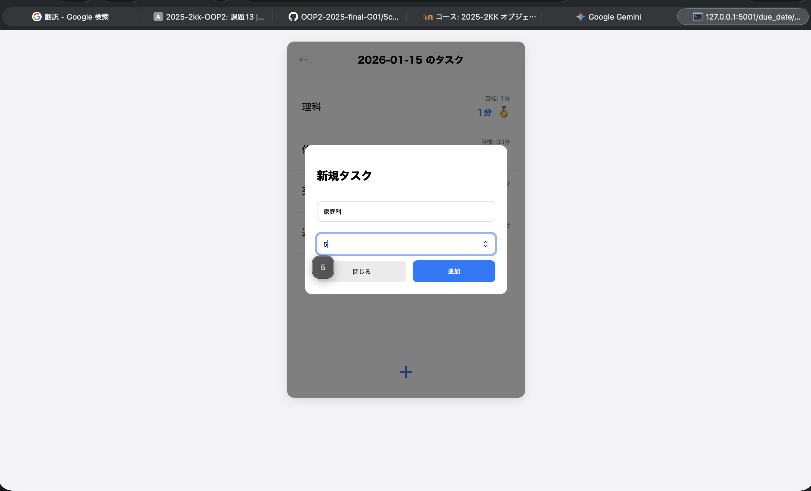

## アプリ名
スケジュール管理アプリ

## 概要
本アプリは、カレンダーにTODOリストを書き込めるスケジュール管理アプリです。

TODOリストで立てた予定をタイマーと直結させ、作業時間を正確に記録できます。「昨日できなかったこと」をシステムが自動で検出し、翌日の画面に「リベンジ項目」として警告を出すことで、計画倒れを防ぎます。

視覚的な分析： 予定に対する達成率や集中時間をグラフ化し、自分の頑張りを客観的に把握できます。

## アピールポイント
一般的なTODOアプリは「やることをメモする」だけですが、本アプリは**「計画・実行・分析・再挑戦」のサイクルを強制的に回す**設計になっています。

1. 「計画倒れ」を許さないリベンジ・リマインド機能

他との違い: 普通のアプリは、昨日終わらなかったタスクはそのまま埋もれてしまいます。

アピール: 本アプリは「昨日できなかったこと」を自動検出し、翌日の画面に**「リベンジ項目」として警告（リマインド）**を出します。これにより、未完了タスクを放置せず、確実にリカバリーする仕組みを提供します。

2. 「予定」と「実績」を直結させるシームレスな体験

他との違い: スケジュール帳とストップウォッチを別々に使う必要がありました。

アピール: TODOリストのタスクをクリックするだけで集中タイマーが即座に連動します。作業時間を1分単位で自動記録し、目標時間を超えると「メダル（🥇）」が付与されるゲーム要素により、モチベーションを維持しながら「実績データ」を蓄積できます。

3. 感情に頼らない、グラフによる客観的分析

他との違い: 「今日は頑張った気がする」という主観的な感想で終わりがちです。

アピール: /api/stats を活用したダッシュボードにより、月間達成率をドーナツチャートで視覚化します。さらに「科目別の合計実作業時間」を自動集計するため、**「どの科目にどれだけ時間を投資したか」**がグラフで一目瞭然。次の計画を立てる際の科学的な根拠になります。

4. 集中を妨げないミニマルなUI/UX

他との違い: 多機能すぎて使いこなせないアプリが多いです。

アピール: 「追加・実行・確認」に機能を絞り込み、あえて「編集・削除を制限」することで、**「一度立てた計画を修正せず、まずはやり遂げる」**というストイックな作業環境を提供します。

## 各機能の説明

### TODOリスト
自分で新たなタスクとタスクごとの目標時間を追加することができます。 
⚠️⚠️⚠️削除、編集はできないので、追加するときに間違えないように確認してください。⚠️⚠️⚠️

### 集中タイマー
タスクをクリックするとタイマーがスタートします。勉強時間はデータベースに保存され、目標時間を越えるとタスクを完了したことを示すメダルが付与されます。

## 使い方
app.py起動にあたって環境設定が必要な可能性があります。ターミナル上で以下のコードを実行してください

仮想環境を作って有効化
python3 -m venv .venv
source .venv/bin/activate

| 依存関係のインストール |
| :--- |
| `pip install -r requirements.txt` |
| `pip install eel` |

ディレクトリ名ScheduleManagerで、起動するためのコード 
python app.py

起動後にブラウザで http://127.0.0.1:5001/ を開くとダッシュボード（`templates/index.html`）が表示されます。

備考：
- `init_db.py` を実行すると `main.db` が初期化され、`todos` テーブルが作成されます。
- `templates/index.html` に月間達成率を表示するドーナツチャートを追加済みです（`/api/stats/monthly` から集計データを取得します）。

## 作業分担

- 兼岩瑶平（K24046）：アプリケーション設計と統合（全体管理担当）
- 冨田琉晴（K24106）：TODOリスト機能の設計と実装（TODOリスト担当）
- 神納雄雅（K24052）：集中タイマーの設計と実装（集中タイマー担当）
- 神戸愛奈（K24053）：履歴・リマインド機能の実装（履歴・リマインド担当）
- 武藤快晟（K24140）：勉強ログ・グラフの実装とダッシュボード統合（勉強ログ・グラフ担当）

## アプリ画像

- トップページ（top.jpg）
    - 
- タスク追加画面1(task1.jpg)
    - 
- タスク追加画面2(task2.jpg)
    - 
- タイマー画面(timer.jpg)
    - 
